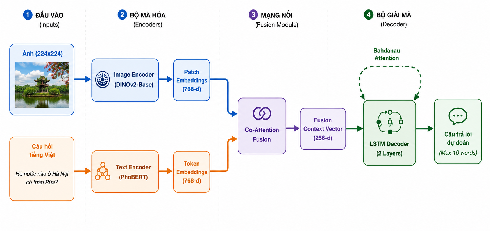
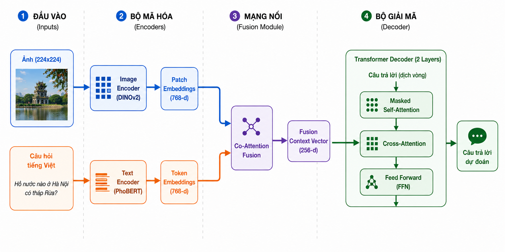
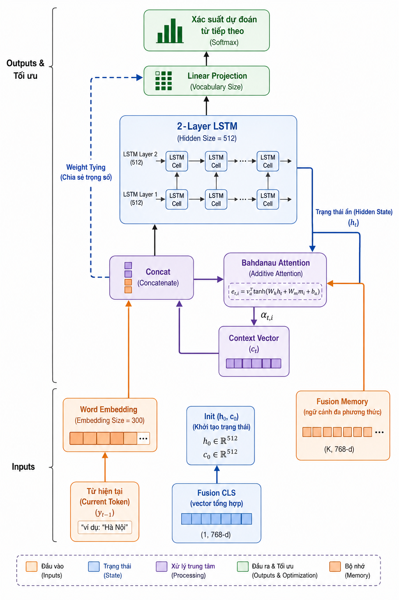
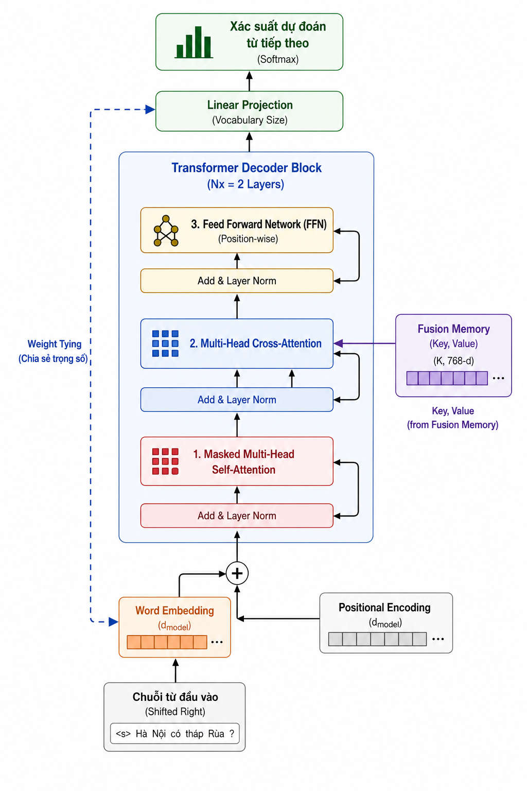
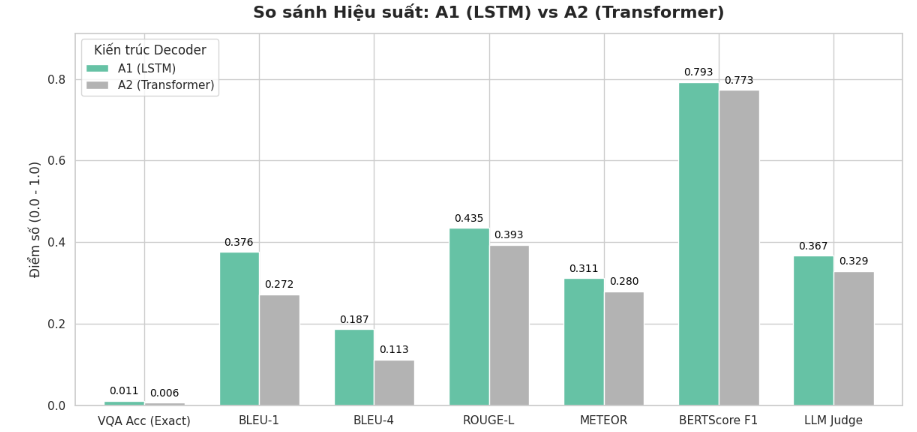
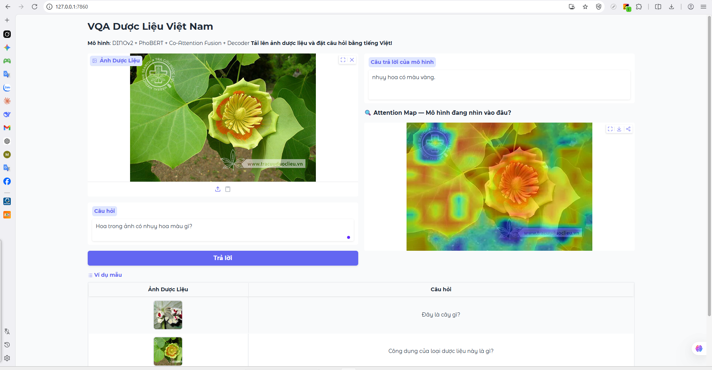

# 🌿 VQA Dược Liệu Việt Nam

> **Mô hình Visual Question Answering (VQA) cho dược liệu Việt Nam**
> Kiến trúc module: **DINOv2** + **PhoBERT** + **Co-Attention Fusion** + **LSTM / Transformer Decoder**

---

<!-- [TODO] Chèn ảnh banner/demo vào đây sau khi có ảnh thật

-->

## 📋 Mục lục

- [Giới thiệu](#-giới-thiệu)
- [Kiến trúc mô hình](#-kiến-trúc-mô-hình)
- [Cài đặt](#-cài-đặt)
- [Sử dụng nhanh](#-sử-dụng-nhanh)
- [Cấu trúc dự án](#-cấu-trúc-dự-án)
- [Kết quả thực nghiệm](#-kết-quả-thực-nghiệm)
- [Demo Web UI](#-demo-web-ui)
- [Dataset &amp; Checkpoint](#-dataset--checkpoint)

---

## 🎯 Giới thiệu

Dự án xây dựng hệ thống trả lời câu hỏi dựa trên hình ảnh (VQA) cho bộ dữ liệu dược liệu y học cổ truyền Việt Nam. Mô hình có khả năng nhận dạng loài cây, mô tả đặc điểm hình thái và trả lời các câu hỏi về công dụng y học.

**Môn học:** Học Sâu (Deep Learning)
**Dữ liệu:** [tracuuduoclieu.vn](https://tracuuduoclieu.vn)
**Môi trường huấn luyện:** Kaggle (GPU T4)

---

## 🏗 Kiến trúc mô hình

### Kiến trúc tổng thể

**Mô hình A1 (LSTM Decoder)**


**Mô hình A2 (Transformer Decoder)**


### Chi tiết Decoder

**Chi tiết LSTM Decoder**


**Chi tiết Transformer Decoder**


---

## ⚙️ Cài đặt

### 1. Clone repo

```bash
git clone https://github.com/<YOUR_USERNAME>/vqa-herb.git
cd vqa-herb
```

### 2. Tạo môi trường ảo và cài thư viện

```bash
python -m venv .venv
# Windows:
.venv\Scripts\activate
# Linux/Mac:
source .venv/bin/activate

pip install -r requirements.txt
```

### 3. Cấu hình biến môi trường

```bash
cp .env.example .env
# Mở .env và điền HF_TOKEN của bạn
```

---

## 🚀 Sử dụng nhanh

### Huấn luyện

```bash
# Giai đoạn 1 — Freeze Encoder, chỉ train Fusion + Decoder
python train.py --decoder transformer --phase 1

# Giai đoạn 2 — Unfreeze một phần Encoder, fine-tune toàn bộ
python train.py --decoder transformer --phase 2

# Tương tự cho LSTM Decoder
python train.py --decoder lstm --phase 1
```

### Đánh giá trên tập Test

```bash
python evaluate.py --decoder transformer
```

### Dự đoán nhanh (CLI)

```bash
python inference.py \
  --image data/sample_images/cam_thao.jpg \
  --question "Đây là cây gì?" \
  --decoder transformer
```

### Demo Web UI (Gradio)

```bash
python app.py --decoder transformer --port 7860
# Mở trình duyệt: http://localhost:7860
```

---

## 📁 Cấu trúc dự án

```
vqa-herb/
├── README.md
├── requirements.txt
├── .gitignore
├── .env.example
│
├── train.py          # Entry point huấn luyện
├── evaluate.py       # Entry point đánh giá
├── inference.py      # Entry point dự đoán CLI
├── app.py            # Gradio Web UI Demo
│
├── configs/
│   └── config.py     # Hyperparameters & đường dẫn
│
├── data/
│   ├── vocab.py      # AnswerVocab
│   ├── dataset.py    # HerbVQADataset, DataLoader
│   └── sample_images/    # [TODO] Thêm 2-3 ảnh dược liệu mẫu
│
├── models/
│   ├── image_encoder.py      # ImageEncoder (DINOv2)
│   ├── text_encoder.py       # TextEncoder (PhoBERT)
│   ├── fusion.py             # CoAttentionFusion
│   ├── decoder_lstm.py       # LSTMDecoder (A1)
│   ├── decoder_transformer.py # TransformerDecoder (A2)
│   └── vqa_model.py          # VQAModel tổng thể
│
├── training/
│   ├── loss.py       # LabelSmoothedCrossEntropy
│   ├── optimizer.py  # build_optimizer_phase1/2
│   └── trainer.py    # train_one_epoch
│
├── evaluation/
│   └── metrics.py    # evaluate, compute_comprehensive_metrics
│
├── utils/
│   └── checkpoint.py # save/load checkpoint, plot_loss_curves
│
├── notebooks/
│   └── dl_final_vqa_vit_base_colab_DeepRL.ipynb  # Notebook gốc
│
└── docs/
    ├── images/           # [TODO] Sơ đồ kiến trúc, biểu đồ kết quả
    └── Bao_Cao_VQA.pdf   # [TODO] Báo cáo 15-20 trang
```

---

## 📊 Kết quả thực nghiệm

| Metric          | A1 (LSTM Decoder) | A2 (Transformer Decoder) |
| :-------------- | :---------------: | :----------------------: |
| VQA Acc (Exact) |      0.0108      |          0.0061          |
| BLEU-1          |      0.3760      |          0.2723          |
| BLEU-4          |      0.1870      |          0.1125          |
| ROUGE-L         |      0.4345      |          0.3932          |
| METEOR          |      0.3114      |          0.2795          |
| BERTScore F1    |      0.7929      |          0.7733          |
| LLM Judge       |      0.3667      |          0.3293          |

**Biểu đồ so sánh kết quả**



---

## 🖥 Demo Web UI

Chạy giao diện Web (Gradio) để dùng thử mô hình:

```bash
# Sử dụng mô hình LSTM (A1)
python vqa-herb/app.py --decoder lstm

# Hoặc sử dụng mô hình Transformer (A2)
python vqa-herb/app.py --decoder transformer
```



<!-- [TODO] Thêm link video demo YouTube/Drive
📹 **Video demo (3-5 phút):** [CHÈN LINK YOUTUBE TẠI ĐÂY]
-->

---

## 📦 Dataset & Checkpoint

| Tài nguyên | Link                                                                                                                              |
| :----------- | :-------------------------------------------------------------------------------------------------------------------------------- |
| Dataset      | [HuggingFace – azan100an/tdtu_vqa_dataset_herb](https://huggingface.co/datasets/azan100an/tdtu_vqa_dataset_herb)                    |
| Checkpoints  | [HuggingFace – azan100an/vqa-herb-checkpoints-Vit_base_colab](https://huggingface.co/azan100an/vqa-herb-checkpoints-Vit_base_colab) |

```bash
# Tải checkpoint tốt nhất về local
python -c "
from huggingface_hub import hf_hub_download
hf_hub_download(
    repo_id='azan100an/vqa-herb-checkpoints-Vit_base_colab',
    filename='vqa_transformer_phase2_best.pt',
    local_dir='checkpoints/'
)
"
```
